# AlgoVista 🚀

**AlgoVista** is a premium, high-performance **Desktop Application** built with JavaFX, designed to transform abstract Data Structures and Algorithms (DSA) into immersive, cinematic visual experiences. 

Whether you are a student mastering the basics or a developer revisiting core concepts, AlgoVista provides an interactive environment to see logic in motion.

---

## 🌟 Key Features

### 🎬 Cinematic Dashboard
* **Sleek UI/UX:** Modern dark-mode interface with smooth transitions and hover effects.
* **Interactive Navigation:** Seamlessly jump between different algorithm categories.
* **Global Controls:** Adjust animation speeds in real-time to match your learning pace.

### 📊 Algorithm Visualizers
* **Sorting Algorithms:** Visualize Bubble Sort, Selection Sort, Insertion Sort, Merge Sort, Quick Sort, Radix Sort, and more.
* **Graph Theory:** Interactive BFS, DFS, Dijkstra’s (Shortest Path), and Topological Sorting.
* **Dynamic Programming:** Step-through visualizations for Fibonacci, Knapsack, and Longest Common Subsequence (LCS).
* **Data Structures:** Real-time manipulation of Linked Lists (Singly/Doubly), Binary Search Trees (BST), Heaps, Stacks, and Queues.
* **Divide & Conquer:** Visual execution of Merge Sort, Quick Sort, and Binary Search.

### 🧠 Intellectual Insights
* **Complexity Analysis:** Dynamic detection of Best, Worst, and Average case time complexities.
* **Code Highlighting:** Synchronized source code highlighting that tracks the visualization step-by-step.
* **State Management:** Ability to pause, resume, and reset visualizations at any time.

---

## 📸 Workflow & Screenshot Gallery

### 1. The Entry Point
Experience a premium startup sequence and a centralized command center.

<p align="center">
  
  
</p>

### 2. Personalization & Team
AlgoVista is designed with the user in mind, featuring deep customization and a dedicated team overview.

<p align="center">
  
  
</p>

---

## 🚀 Interactive Modules

### 📂 Category Explorer
Every algorithm category is represented by a stunning, interactive card system, ordered as they appear in the dashboard.

| Linked List | Graph | Binary Search Tree | Sorting |
| :---: | :---: | :---: | :---: |
| 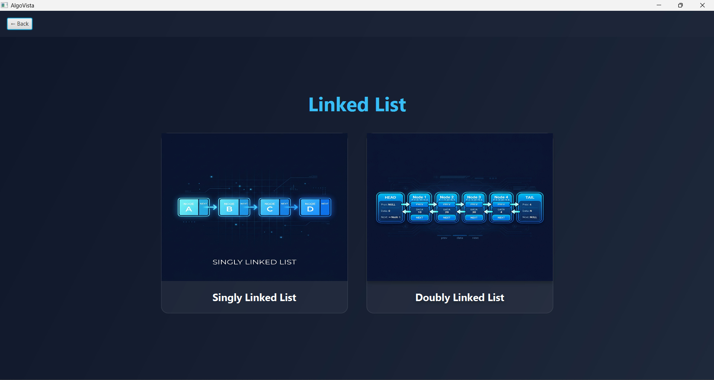 | 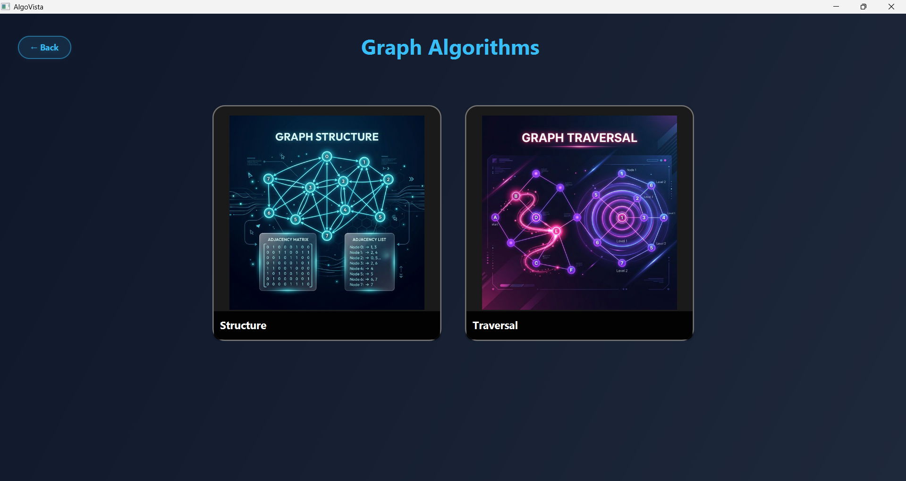 | 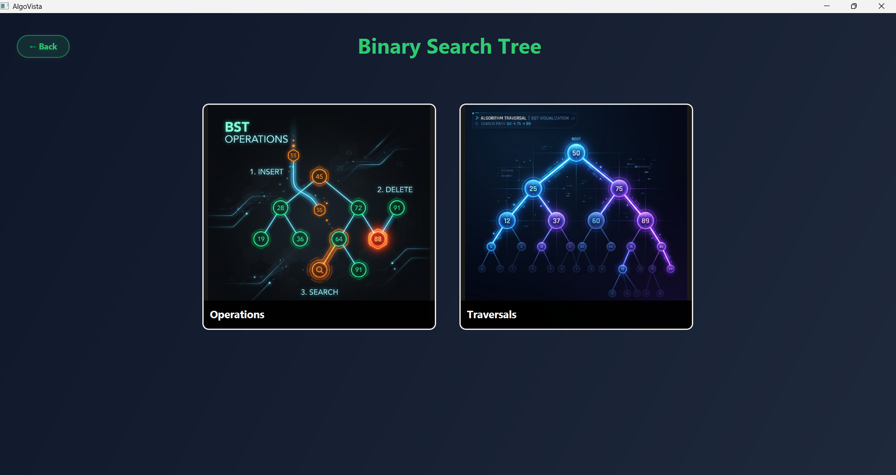 | 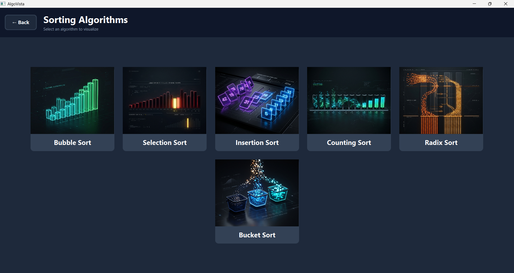 |

| Recursion | Divide & Conquer | Dynamic Programming |
| :---: | :---: | :---: |
| 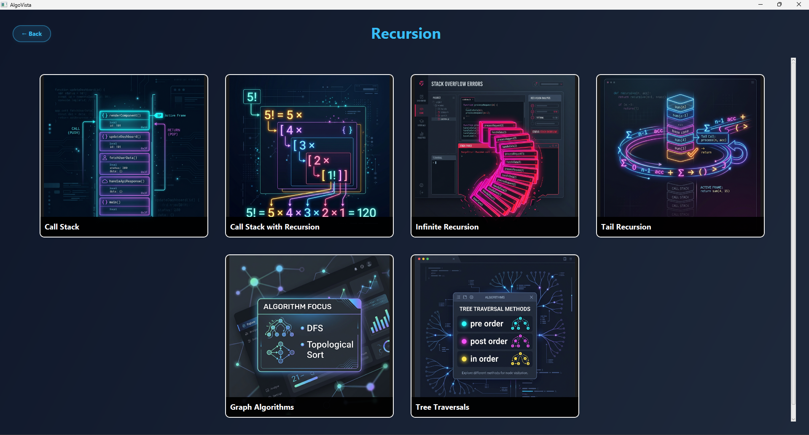 | 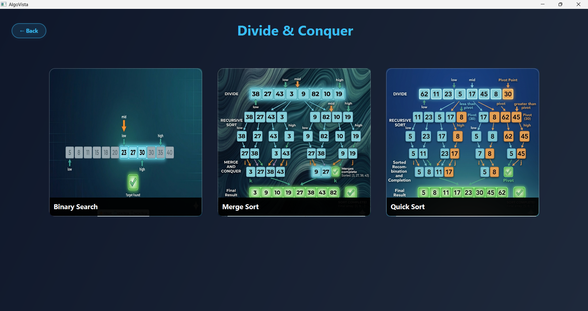 | 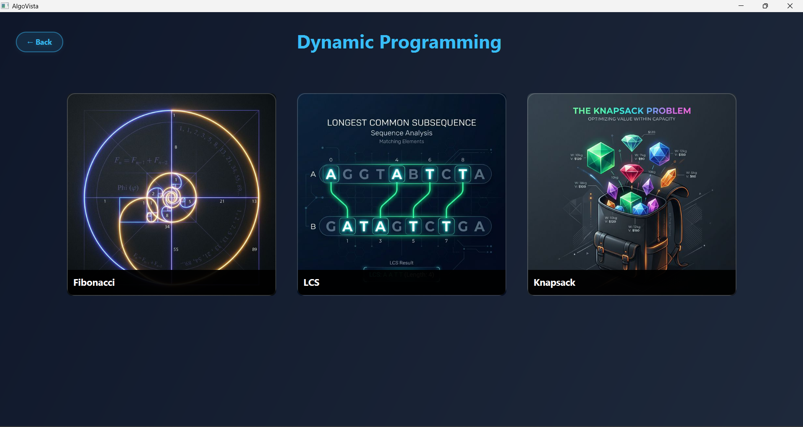 |

---

## 🛠️ Step-by-Step Algorithm Workflows

### ⛓️ 1. Linked List & Linear Data Structures
Visualizing LIFO, FIFO, and linear data manipulation with precision.

<p align="center">
  
  <br><i>Gateway to the Linear Data Structures module.</i>
</p>

* **Doubly Linked List Traversal:**
  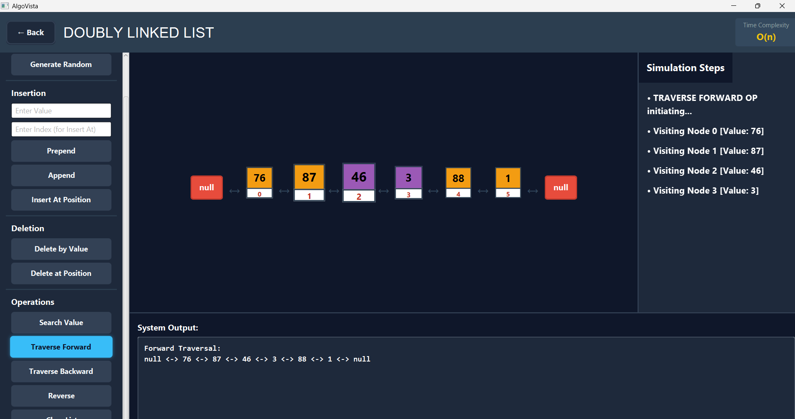
  *Forward traversal through a Doubly Linked List, highlighting the current node and its pointers.*

* **Stack Operations:**
  <p align="center">
    
    
    <br><i>Left: Visualizing the 'pop' operation. Right: Sequential traversal of stack elements.</i>
  </p>

* **Queue & Array:**
  <p align="center">
    
    
    <br><i>Left: Searching for a specific value within a Queue. Right: Visualizing the in-place array reversal algorithm.</i>
  </p>

---

### 🕸️ 2. Graphs
Solving complex connectivity problems through sub-problems and pathfinding.

<p align="center">
  
  <br><i>Gateway to the Graph algorithms module.</i>
</p>

* **Graph Structure & Traversal:**
  <p align="center">
    
    
    <br><i>Left: Defining the adjacency matrix/list structure. Right: Real-time visualization of BFS across connected nodes.</i>
  </p>

* **Algorithm Compatibility & Alerts:**
  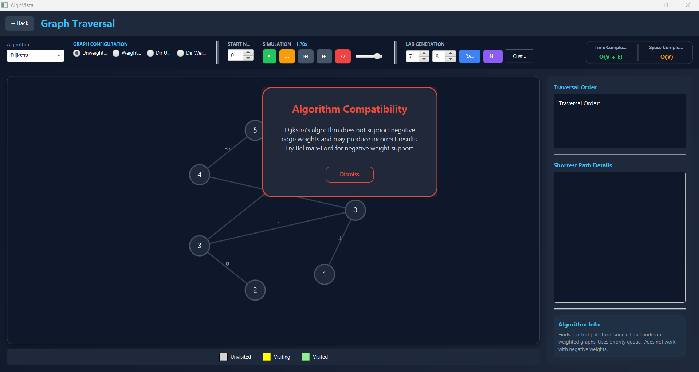
  *Proactive educational alerts: A custom dialogue warns the user when trying to run Dijkstra’s algorithm on a graph with negative weights.*

---

### 🌲 3. Binary Search Tree (BST)
Real-time node manipulation, balancing, and property analysis.

<p align="center">
  
  <br><i>Dynamic Binary Search Tree management interface.</i>
</p>

* **Level Order Traversal & Deletion:**
  <p align="center">
    
    
    <br><i>Left: Breadth-first level-order tree traversal. Right: Handling complex node deletions and automatic re-balancing.</i>
  </p>

* **Tree Properties:**
  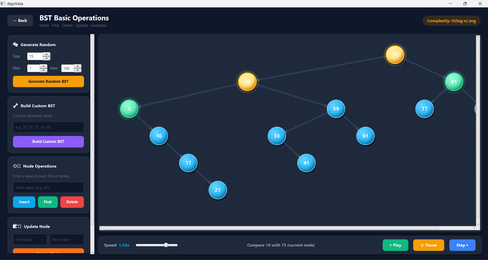
  *Automatic calculation of tree height, total internal nodes, and leaf node distribution.*

---

### 📊 4. Sorting Algorithms
Watch data organize itself through various algorithmic paradigms.

<p align="center">
  
  <br><i>Comprehensive library of popular sorting paradigms.</i>
</p>

* **Selection & Counting Sort:**
  <p align="center">
    
    
    <br><i>Left: Selection Sort highlighting the current minimum element. Right: Non-comparative sorting using frequency arrays.</i>
  </p>

* **Heap Sort:**
  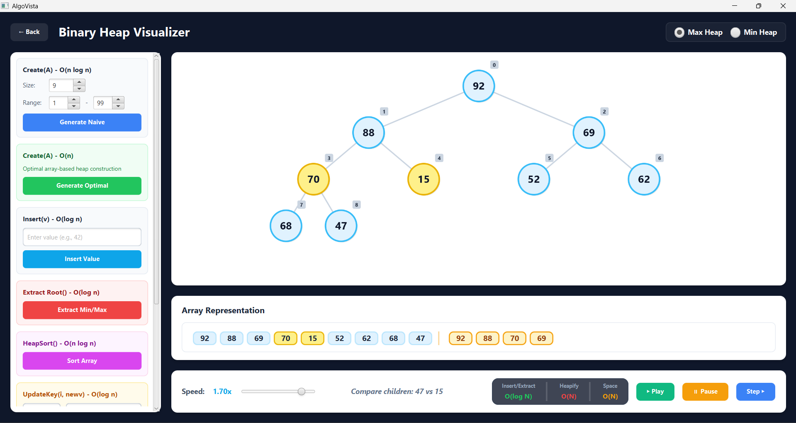
  *Transforming a standard array into a heap structure for efficient sorting.*

---

### 🧠 5. Recursion
Deep dive into recursive call stacks and flow control.

<p align="center">
  
  <br><i>Visual exploration of recursion paths and call stack logic.</i>
</p>

* **Recursive Topological Sort:**
  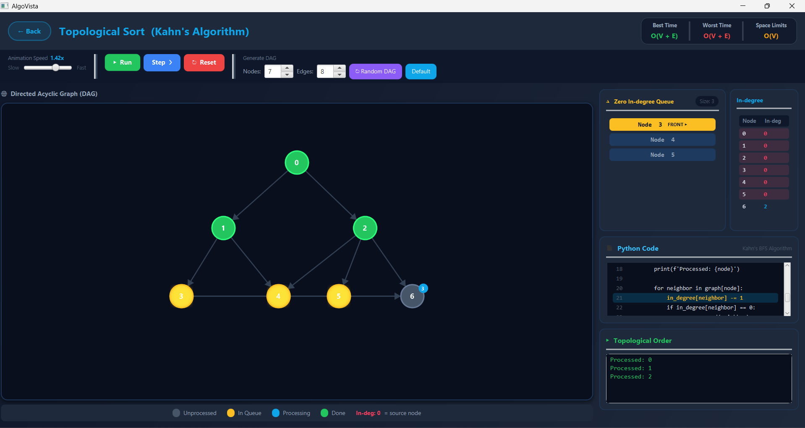
  *Using depth-first recursion to resolve dependencies in a Directed Acyclic Graph (DAG).*

* **Call Stack & Tail Recursion:**
  <p align="center">
    
    
    <br><i>Left: Visualizing the growth of the call stack. Right: Optimizing function calls through Tail Recursion.</i>
  </p>

* **Recursive Fibonacci Sequence:**
  <p align="center">
    
    
    <br><i>Standard Recursion: Visualizing the exponential growth of the call tree without memory optimization.</i>
  </p>
  <p align="center">
    
    
    <br><i>Optimized Execution: Implementation of memory optimization and constant space logic to streamline the calculation.</i>
  </p>

* **Advanced Recursion:**
  <p align="center">
    
    
    <br><i>Left: Visualizing stack overflow risks. Right: Recursive DFS for In-order tree traversal.</i>
  </p>

---

### ⚔️ 6. Divide & Conquer
Solving large problems through recursive partitioning and merging.

<p align="center">
  
  <br><i>Visualizing the powerful Divide and Conquer paradigm.</i>
</p>

* **Merge Sort Workflow:**
  <p align="center">
    
    
    <br><i>Sequence: Splitting into atomic sub-problems and merging back to a sorted whole.</i>
  </p>

* **Quick Sort Partitioning:**
  <p align="center">
    
    
    
    
    <br><i>Step-by-step partitioning logic using pivot-based organization.</i>
  </p>

---

### 🧩 7. Dynamic Programming
Optimizing solutions through tabulation and memoization.

<p align="center">
  
  <br><i>Tabular exploration of Dynamic Programming algorithms.</i>
</p>

* **0/1 Knapsack Sequence:**
  <p align="center">
    
    
    
    
    <br><i>Building the DP table to find the maximum value subset.</i>
  </p>

* **Longest Common Subsequence (LCS):**
  <p align="center">
    
    
    <br><i>Tracking overlapping subsequences across multiple strings.</i>
  </p>

---

## 🛠️ Tech Stack & Architecture

* **Language:** Java 17+
* **Framework:** JavaFX 21+ (Rich Client Platform)
* **Styling:** Vanilla CSS (Modern aesthetic with custom transitions)
* **Layout:** FXML (Declarative UI structure)
* **Build System:** IntelliJ IDEA 

---

## 🚀 Getting Started 


### 📋 Prerequisites
* **Java Development Kit (JDK) 17 or higher** (Tested on JDK 21).
* **JavaFX SDK 21+** (Necessary for the GUI animations).

### 🛠️ Installation Guideline

1. **Extract the Project:**
   Unzip the `AlgoVista.zip` file to a local directory on your machine.
2. **Open in Your IDE:**
   * **IntelliJ IDEA:** File > Open > Select the `Java_Fx` folder.
   * **Eclipse/NetBeans:** Import as an existing project.
2. **Configure JavaFX Libraries:**
   * Go to **Project Structure** (Ctrl+Alt+Shift+S in IntelliJ).
   * Under **Libraries**, add the JavaFX `lib` folder from your local SDK.
   * Add the following **VM Options** in your Run Configuration to link the modules:
     ```text
     --module-path /path/to/javafx-sdk/lib --add-modules javafx.controls,javafx.fxml,javafx.media
     ```
3. **Run the Application:**
   Run the `Main.java` file found at:  
   `src/com/AlgoVista/dashboard/Main.java`.

---

## 🛠️ Maintenance & Utilities
The project includes a `maintenance/` folder containing Python utility scripts used during development for FXML decoding and project auditing. These are not required to run the main Java application but are included for structural completeness.

---

## 📖 Usage Workflow

1. **Select a Category:** Choose from Sorting, Graphs, Trees, Recursion, etc., from the main dashboard.
2. **Input Data:** Generate random data or input your own custom values (e.g., custom arrays for BST).
3. **Control Animation:** Use the slider at the bottom to speed up or slow down the visualization.
4. **Analyze:** Watch the code highlights and complexity labels to understand the logic deeply.

---

## 🤝 Contributing
Contributions are welcome! If you'd like to add new algorithms or improve the UI, feel free to fork the repo and submit a PR. 

---

## 📄 License
This project is licensed under the MIT License - see the [LICENSE](LICENSE) file for details.

---

### ✨ Connect with Me

<p align="left">
  <a href="https://www.linkedin.com/in/badhon-pain-634341378" target="_blank">
    
  </a>
  <a href="https://www.youtube.com/@thursty_pain_2022" target="_blank">
    
  </a>
  <a href="mailto:badhonpain48@gmail.com">
    
  </a>
</p>

Created by [Badhon Pain](https://github.com/BadhonPain) & [Joyshree Mukharjee Joya](https://github.com/joyshree-joya)
