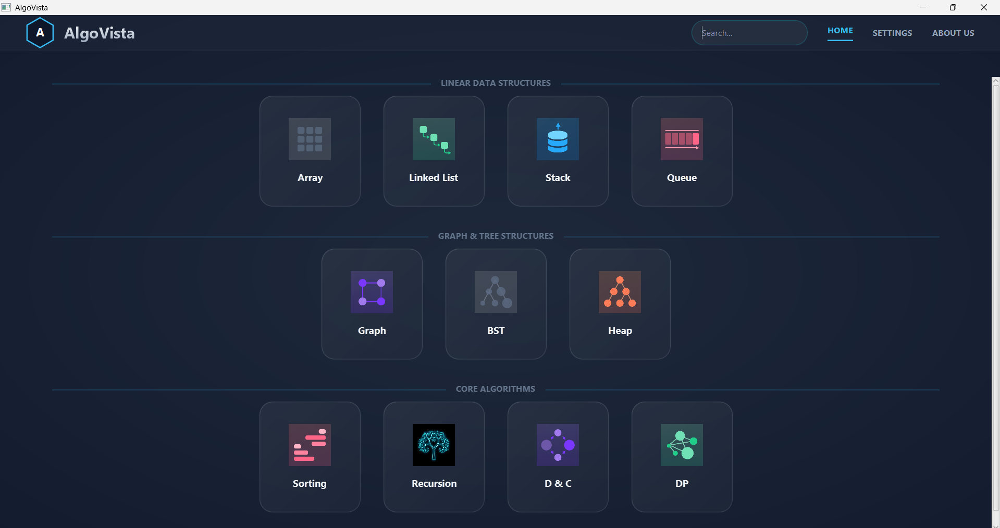
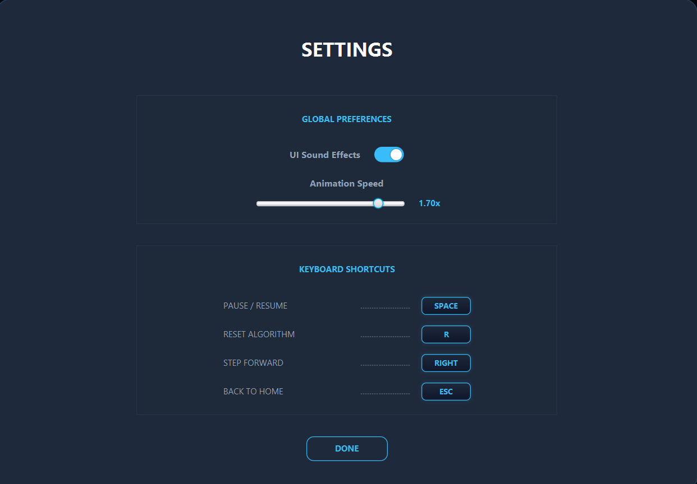
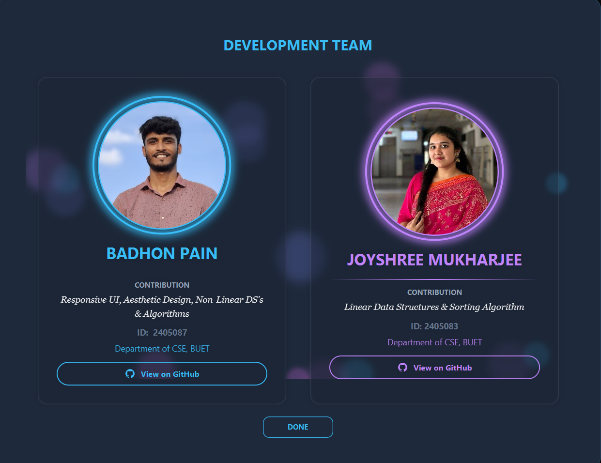

# AlgoVista 🚀

**AlgoVista** is a premium, high-performance **Desktop Application** built with JavaFX, designed to transform abstract Data Structures and Algorithms (DSA) into immersive, cinematic visual experiences. 

Whether you are a student mastering the basics or a developer revisiting core concepts, AlgoVista provides an interactive environment to see logic in motion.

---

## 🌟 Key Features

### 🎬 Cinematic Dashboard
* **Sleek UI/UX:** Modern dark-mode interface with smooth transitions and hover effects.
* **Interactive Navigation:** Seamlessly jump between different algorithm categories.
* **Global Controls:** Adjust animation speeds in real-time to match your learning pace.

### 📊 Algorithm Visualizers
* **Sorting Algorithms:** Visualize Bubble Sort, Selection Sort, Insertion Sort, Merge Sort, Quick Sort, Radix Sort, and more.
* **Graph Theory:** Interactive BFS, DFS, Dijkstra’s (Shortest Path), and Topological Sorting.
* **Dynamic Programming:** Step-through visualizations for Fibonacci, Knapsack, and Longest Common Subsequence (LCS).
* **Data Structures:** Real-time manipulation of Linked Lists (Singly/Doubly), Binary Search Trees (BST), Heaps, Stacks, and Queues.
* **Divide & Conquer:** Visual execution of Merge Sort, Quick Sort, and Binary Search.

### 🧠 Intellectual Insights
* **Complexity Analysis:** Dynamic detection of Best, Worst, and Average case time complexities.
* **Code Highlighting:** Synchronized source code highlighting that tracks the visualization step-by-step.
* **State Management:** Ability to pause, resume, and reset visualizations at any time.

---

## 📸 Workflow & Screenshots

> [!TIP]
> Use the following placeholders to showcase your app's stunning UI on GitHub.

### 1. The Dashboard


### 2. Settings


### 3. Development Team


### 4. Tree Manipulations
*Dynamic building and balancing of a Binary Search Tree (BST).*


---

## 🛠️ Tech Stack & Architecture

* **Language:** Java 17+
* **Framework:** JavaFX 21+ (Rich Client Platform)
* **Styling:** Vanilla CSS (Modern aesthetic with custom transitions)
* **Layout:** FXML (Declarative UI structure)
* **Build System:** IntelliJ IDEA / Gradle / Maven (depending on your setup)

---

## 🚀 Getting Started

### Prerequisites
* **Java Development Kit (JDK) 17 or higher**
* **JavaFX SDK** (configured in your IDE or path)

### Installation
1. **Clone the repository:**
   ```bash
   git clone https://github.com/your-username/AlgoVista.git
   ```
2. **Open in IDE:**
   Import the project into IntelliJ IDEA or Eclipse.
3. **Configure JavaFX:**
   Ensure the JavaFX library is added to your project's build path.
4. **Run:**
   Execute the `Main.java` located in `src/com/AlgoVista/dashboard/Launcher.java`.

---

## 📖 Usage Workflow

1. **Select a Category:** Choose from Sorting, Graphs, Trees, Recursion, etc., from the main dashboard.
2. **Input Data:** Generate random data or input your own custom values (e.g., custom arrays for BST).
3. **Control Animation:** Use the slider at the bottom to speed up or slow down the visualization.
4. **Analyze:** Watch the code highlights and complexity labels to understand the logic deeply.

---

## 🤝 Contributing
Contributions are welcome! If you'd like to add new algorithms or improve the UI, feel free to fork the repo and submit a PR. 

---

## 📄 License
This project is licensed under the MIT License - see the [LICENSE](LICENSE) file for details.

---

### ✨ Connect with Me
[Your LinkedIn Profile] | [Your Portfolio] | [Your Email]
